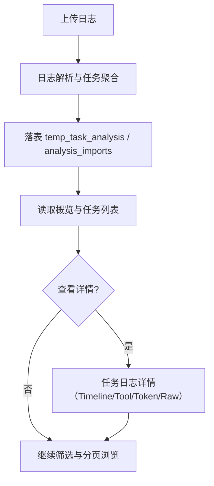
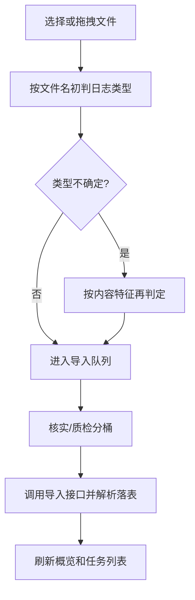

# Claude Log Analyzer

本项目用于对 Claude/Skill 执行日志进行解析，并面向“大 POI 核实与质检”场景提供看板化可视分析。  
当前支持日志导入、任务维度聚合、核实/质检概览、任务详情与日志详情可视化。

## 1. 项目目标
- 支持批量上传核实日志与质检日志，并自动识别日志类型。
- 对大日志先做解析落表，再通过数据库读取实现快速展示。
- 提供业务可用的概览指标：任务量、耗时、Token、成本、自动化率、核实质量等。
- 保留日志分析页能力（时间线、工具分析、Token 分析、原始日志查看）。

## 2. 角色与子项目分工
| 角色/模块 | 职责 | 目录 |
|---|---|---|
| 前端看板（Dashboard） | 首页概览、筛选、分页、任务详情入口、上传交互 | `src/components/dashboard` |
| 日志分析组件（Legacy） | 时间线、工具分析、Token 分析、原始日志展示 | `src/components/legacy` |
| API 服务 | 概览、列表、日志详情、导入与清缓存接口 | `server/index.ts` |
| 仓储层 | SQLite mock、聚合查询、业务口径计算 | `server/repository.ts` |
| 解析服务 | 批处理日志与 Claude 日志解析、任务聚合落表 | `server/analysisService.ts`, `server/parsers/*` |

## 3. 稳定版本关联矩阵
| 项目版本 | 前端状态 | 后端状态 | 数据源 | 说明 |
|---|---|---|---|---|
| `v0.1.0` | 基础日志分析页 | 基础接口 | 本地样例 | 初始可用版本 |
| `Unreleased` | 看板首页 + 旧风格日志分析组件复用 | 指标口径完善（含自动化率/核实质量） | SQLite mock（可迁移 PG） | 当前开发主线 |

## 4. 运行与开发
### 4.1 依赖安装
```bash
npm install
```

### 4.2 启动方式
```bash
# 前端
npm run dev:web

# 后端
npm run dev:api
```

默认端口：
- 前端：`http://localhost:3000`
- 后端：`http://localhost:3001`

### 4.3 构建与检查
```bash
npm run lint
npm run build
```

## 5. 数据与表说明
### 5.1 业务只读表（禁止写入/删除）
- `poi_init`
- `poi_verified`
- `poi_qc`

### 5.2 日志分析临时表（可清理）
- `temp_task_analysis`
- `analysis_imports`

清缓存接口仅清理临时表，不会修改业务只读表。

## 6. 指标口径（当前实现）
- 成本统一按 Token 计算（GLM 口径）：
  - 输入：`4 元 / 百万 token`
  - 输出：`18 元 / 百万 token`
- 自动化率（核实概览）：
  - `1 - (verify_result='需人工核实' 数量 / verify_result 非空总数)`
- 核实质量（质检概览）：
  - 分子：
    - `verify_result='核实通过' AND is_qualified=1`
    - `verify_result='需人工核实' AND is_qualified!=1`
    - 两部分相加
  - 分母：已质检总量（`is_qualified IS NOT NULL`）

## 7. SOP
### 7.1 一级流程（端到端）


### 7.2 二级流程（上传与分类）


### 7.3 节点说明表
| 节点 | 类型 | 说明 | 输入 | 输出 | 异常说明 |
|---|---|---|---|---|---|
| 上传日志 | 用户操作 | 选择/拖拽日志文件 | 本地文件 | 文件流 | 文件编码或格式不合法 |
| 日志解析与任务聚合 | 服务处理 | 解析执行日志并聚合任务 | 日志文本 | 聚合任务记录 | task_id 缺失导致关联失败 |
| 临时落表 | 数据持久化 | 将聚合结果写入临时表 | 聚合记录 | 可查询数据 | DB 连接失败 |
| 概览与列表读取 | 查询 | 输出概览卡与任务列表 | 过滤参数 | 页面数据 | SQL 执行异常 |
| 任务日志详情 | 可视分析 | 按 task_id 展示时间线等 | task_id | 详情视图 | 无匹配日志 |

## 8. 目录结构
```text
.
|-- server/
|   |-- index.ts
|   |-- repository.ts
|   |-- analysisService.ts
|   `-- parsers/
|-- src/
|   |-- components/
|   |   |-- dashboard/
|   |   `-- legacy/
|   |-- lib/
|   |-- App.tsx
|   `-- main.tsx
|-- example/
|   `-- db_conf/
|-- README.md
`-- CHANGELOG.md
```

