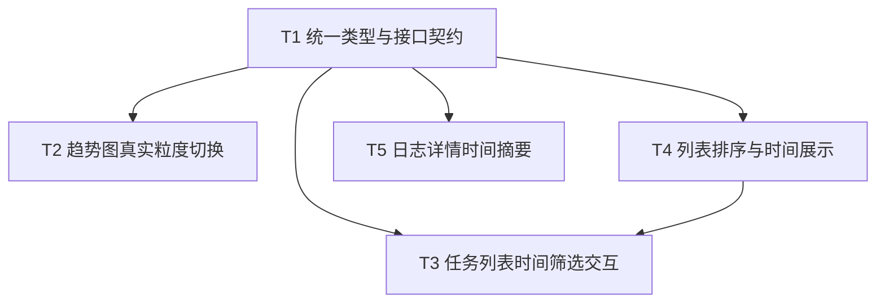

# 执行流量趋势与时间交互修复优化开发计划

## 1. 开发目标

基于 `01-requirements.md` 中确认的需求，本轮开发计划聚焦以下 4 个可交付目标：

1. 修复执行流量趋势图的真实粒度切换，补回 `按 5 小时`，并支持交互式图例开关。
2. 将任务详情列表的时间筛选升级为“快捷项 + 单时间点快筛 + 进阶时间段”。
3. 修复任务详情列表排序感知问题，补齐“最新动作时间”“核实时间”“质检时间”的可视化展示，并统一 SQLite / PostgreSQL 排序口径。
4. 在日志详情页补齐阶段级时间摘要，让用户进入日志页面后能快速建立时间上下文。

---

## 2. 本轮范围与边界

## 2.1 本轮纳入范围

- 主看板趋势图的粒度切换与图例交互
- 主看板任务列表的时间筛选交互升级
- 任务卡片折叠态的时间信息展示
- 任务日志详情页的时间摘要补齐
- 后端接口与双仓储（SQLite / PostgreSQL）时间口径对齐

## 2.2 本轮不纳入范围

- 不新增独立的高级筛选弹窗
- 不重做任务列表整体布局
- 不修改上传/导入相关流程
- 不新增新的业务统计指标
- 不处理与本轮时间体验无关的样式优化

---

## 3. 当前改造触点清单

本轮开发预计涉及以下核心文件。

### 3.1 后端

- `server/index.ts`
- `server/types.ts`
- `server/repository.ts`
- `server/repository.pg.ts`

### 3.2 前端接口与类型

- `src/lib/dashboardApi.ts`
- `src/lib/dashboardTypes.ts`

### 3.3 前端页面与组件

- `src/components/dashboard/DashboardHome.tsx`
- `src/components/dashboard/TimeseriesChart.tsx`
- `src/components/dashboard/TaskFlowCard.tsx`
- `src/components/dashboard/dashboardModel.ts`
- `src/components/dashboard/TaskLogPage.tsx`

---

## 4. 总体实施方案

## 4.1 基本策略

- **后端先行**：先统一接口契约与数据口径，再改前端交互，避免前端临时写死逻辑。
- **双仓储同步**：每项时间逻辑改造都要同时覆盖 SQLite 和 PostgreSQL，避免正式环境与本地调试行为不一致。
- **增量替换**：保留现有页面骨架和大部分组件结构，只替换时间相关的状态、数据与局部展示。
- **URL 继续承载筛选状态**：时间筛选仍通过 URL 参数驱动，保证刷新可恢复、链接可分享。

## 4.2 推荐开发顺序

1. 先改后端类型与接口契约
2. 再改趋势图真实聚合
3. 再改任务列表排序与时间字段返回
4. 再改日志详情摘要接口
5. 最后接入前端筛选与展示交互

---

## 5. 可执行任务拆解

## 5.1 T1：统一时间相关类型与接口契约

### 5.1.1 目标

为趋势图粒度、任务列表排序展示、日志详情时间摘要建立统一的数据契约。

### 5.1.2 修改文件

- `server/types.ts`
- `src/lib/dashboardTypes.ts`
- `src/lib/dashboardApi.ts`
- `server/index.ts`

### 5.1.3 具体改动

#### `server/types.ts`

- 新增趋势图粒度类型：
  - `DashboardTimeGranularity = "hour" | "five_hour" | "day"`
- 在 `DashboardFilters` 中新增：
  - `timeGranularity?: DashboardTimeGranularity`
- 新增任务列表最新动作信息结构：
  - `latestActionTime?: string | null`
  - `latestActionType?: "qc" | "verify" | "init" | null`
- 新增日志详情时间摘要结构：
  - `PhaseLogSummary`
  - 包含 `startedAt / endedAt / businessTime / durationMs / status`

#### `src/lib/dashboardTypes.ts`

- 为前端同步新增：
  - 趋势图粒度枚举
  - `DashboardTaskItem.latestActionTime`
  - `DashboardTaskItem.latestActionType`
  - `TaskLogDetail.verifySummary`
  - `TaskLogDetail.qcSummary`

#### `src/lib/dashboardApi.ts`

- `fetchOverview` 增加 `timeGranularity` 参数
- `TaskQuery` 增加前端时间粒度字段

#### `server/index.ts`

- `parseFilters()` 解析 `timeGranularity`
- `/api/dashboard/overview` 调用 `getOverview()` 时透传粒度参数

### 5.1.4 完成标准

- 前后端类型定义一致
- 不再依赖组件内部临时推导字段名
- 后续任务均可直接基于统一契约开发

---

## 5.2 T2：修复执行流量趋势图真实粒度切换

### 5.2.1 目标

让 `按小时 / 按 5 小时 / 按天` 都基于真实聚合结果生效，而不是只换显示格式。

### 5.2.2 修改文件

- `server/repository.ts`
- `server/repository.pg.ts`
- `src/lib/dashboardApi.ts`
- `src/components/dashboard/DashboardHome.tsx`
- `src/components/dashboard/TimeseriesChart.tsx`

### 5.2.3 后端改动

#### PostgreSQL：`server/repository.pg.ts`

- 修改 `getOverview()` 签名，接收 `timeGranularity`
- 将时间趋势 SQL 从固定小时分桶改成按粒度分支生成：
  - `hour`：按小时截断
  - `five_hour`：按 5 小时自然窗口分桶
  - `day`：按日期分桶
- 保持趋势时间口径：
  - 核实优先 `verify` 运行记录 `started_at`，否则回退 `verify_time`
  - 质检优先 `qc` 运行记录 `started_at`，否则回退 `qc_time`

#### SQLite：`server/repository.ts`

- 与 PostgreSQL 保持同一分桶语义
- 不再固定使用 `substr(..., 1, 13) || ':00'`
- 为三种粒度分别生成 `time_block`

### 5.2.4 前端改动

#### `src/components/dashboard/DashboardHome.tsx`

- 将 `granularity` 从 `"day" | "hour"` 扩展到 `"hour" | "five_hour" | "day"`
- `loadOverviewAndTasks()` 调用 `fetchOverview()` 时传入 `granularity`
- 页面切换粒度时只刷新概览，不影响任务列表筛选状态

#### `src/components/dashboard/TimeseriesChart.tsx`

- 补回 `按 5 小时` 按钮
- `formatXAxis()` 与 Tooltip 根据不同粒度返回不同文案
- 替换默认 `Legend` 为可交互图例
- 增加本地显示状态：
  - `showVerify`
  - `showQc`
- 保证至少一个系列保持开启

### 5.2.5 关键实现约束

- 不在前端做重新分桶
- 不使用“按天时仅隐藏小时”的临时方案
- 趋势图排序仍按时间正序

### 5.2.6 完成标准

- 切换 `hour / five_hour / day` 时，数据点数量与 Tooltip 文案同步变化
- 可单独隐藏核实系列或质检系列
- 图例交互不会导致空图或报错

---

## 5.3 T3：升级任务详情列表时间筛选交互

### 5.3.1 目标

将任务列表筛选从“日期级”升级到“小时级 + 快捷模式优先”的高频排查交互。

### 5.3.2 修改文件

- `src/components/dashboard/DashboardHome.tsx`
- `src/lib/dashboardApi.ts`

### 5.3.3 前端状态设计

在 `DashboardHome.tsx` 中新增本地 UI 状态：

- `timePreset`
  - `all | one_hour | five_hour | today | custom`
- `timeMode`
  - `after | before | range`
- `timeAnchor`
  - 单时间点输入值

说明：

- 接口层继续只依赖 `startTime / endTime`
- `timePreset / timeMode / timeAnchor` 主要服务于交互与 URL 还原

### 5.3.4 具体交互实现

#### 快捷项

- 按钮固定为：
  - `1 小时`
  - `5 小时`
  - `当天`
  - `全部`
- 页面初次进入默认高亮 `全部`
- 点击快捷项时：
  - 计算对应的 `startTime / endTime`
  - 回写 URL
  - 标记 `timePreset`

#### 自定义模式

- 默认展示一个 `datetime-local` 输入框与模式切换：
  - `之后`
  - `之前`
  - `时间段`
- `之后`
  - 只写 `startTime`
  - 清空 `endTime`
- `之前`
  - 只写 `endTime`
  - 清空 `startTime`
- `时间段`
  - 展示两个 `datetime-local`
  - 同时写入 `startTime / endTime`

### 5.3.5 URL 与恢复策略

建议 URL 追加以下可选参数：

- `timePreset`
- `timeMode`
- `timeAnchor`

实际请求仍只依赖：

- `startTime`
- `endTime`

这样可兼顾：

- 页面刷新恢复当前交互态
- 分享链接时保留筛选语义

### 5.3.6 完成标准

- 快捷项默认 `全部`
- `1 小时 / 5 小时 / 当天` 点击后立即生效
- 自定义 `之前 / 之后 / 时间段` 可正确映射到接口参数
- 时间筛选变化后，概览与列表联动刷新

---

## 5.4 T4：修复任务列表排序并补齐时间展示

### 5.4.1 目标

让“默认按最新动作时间排序”既在代码里成立，也在界面上可被用户感知。

### 5.4.2 修改文件

- `server/repository.ts`
- `server/repository.pg.ts`
- `src/lib/dashboardTypes.ts`
- `src/components/dashboard/TaskFlowCard.tsx`
- `src/components/dashboard/DashboardHome.tsx`

### 5.4.3 后端改动

#### `server/repository.pg.ts`

- 在 `merged` CTE 中显式生成：
  - `latest_action_time`
  - `latest_action_type`
- 保持排序为：
  - `COALESCE(qc_time, verify_time, updatetime) DESC NULLS LAST`
- 将 `latest_action_time / latest_action_type` 返回给前端

#### `server/repository.ts`

- 从当前“主要按 `updatetime` 排序”修正为：
  - `qc_time > verify_time > updatetime`
- 同步返回：
  - `latest_action_time`
  - `latest_action_type`

### 5.4.4 前端改动

#### `src/components/dashboard/DashboardHome.tsx`

- 在“任务详情列表”标题区补一行说明：
  - `默认按最新动作时间倒序`

#### `src/components/dashboard/TaskFlowCard.tsx`

- 在卡片折叠态增加时间摘要区，建议展示：
  - 最新动作时间
  - 时间来源标签
  - 核实时间
  - 质检时间
- 时间来源标签映射：
  - `qc` → `质检时间`
  - `verify` → `核实时间`
  - `init` → `初始更新时间`

### 5.4.5 关键实现约束

- 不在前端自行用已有字段拼最新动作时间
- 以后端返回的 `latestActionTime / latestActionType` 作为唯一排序解释来源

### 5.4.6 完成标准

- SQLite 与 PostgreSQL 排序结果口径一致
- 折叠态卡片能直接看到排序所依据的时间
- 用户不展开卡片也能理解列表为什么这样排

---

## 5.5 T5：补齐日志详情页时间摘要

### 5.5.1 目标

让日志详情页在原始日志阅读前，先呈现阶段级时间摘要。

### 5.5.2 修改文件

- `server/repository.ts`
- `server/repository.pg.ts`
- `src/lib/dashboardTypes.ts`
- `src/components/dashboard/TaskLogPage.tsx`

### 5.5.3 后端改动

#### `getTaskLogDetail()`

- 在现有返回值上增加：
  - `verifySummary`
  - `qcSummary`
- 字段内容：
  - `startedAt`
  - `endedAt`
  - `businessTime`
  - `durationMs`
  - `status`

数据优先级：

- `startedAt / endedAt / durationMs / status` 优先取最新运行记录
- `businessTime`
  - 核实取 `verify_time`
  - 质检取 `qc_time`

### 5.5.4 前端改动

#### `src/components/dashboard/TaskLogPage.tsx`

- 在“日志总览”区域的摘要卡中追加时间信息
- `核实日志` 卡新增：
  - 开始时间
  - 结束时间
  - 业务时间
  - 耗时
- `质检日志` 卡新增：
  - 开始时间
  - 结束时间
  - 业务时间
  - 耗时
- 当前阶段卡可继续保留，不单独承担时间摘要职责

### 5.5.5 完成标准

- 进入日志详情页即可看到核实/质检阶段时间
- 阶段没有日志时显示 `-`，不展示误导性文案

---

## 6. 任务间依赖关系



说明：

- `T1` 必须最先完成，否则前后端类型会反复改。
- `T4` 应早于 `T3` 完成，因为任务列表的排序解释与时间展示会影响筛选联调。

---

## 7. 详细实施顺序

## 7.1 第一步：后端契约与趋势图

1. 修改 `server/types.ts`
2. 修改 `server/index.ts`
3. 修改 `server/repository.pg.ts` 的 `getOverview`
4. 修改 `server/repository.ts` 的 `getOverview`
5. 修改 `src/lib/dashboardTypes.ts`
6. 修改 `src/lib/dashboardApi.ts`
7. 修改 `src/components/dashboard/TimeseriesChart.tsx`
8. 修改 `src/components/dashboard/DashboardHome.tsx` 的趋势图粒度逻辑

## 7.2 第二步：排序与列表时间展示

1. 修改 `server/repository.pg.ts` 的任务列表 SQL
2. 修改 `server/repository.ts` 的任务列表 SQL
3. 修改 `normalizeTask` 相关映射
4. 修改 `src/lib/dashboardTypes.ts`
5. 修改 `src/components/dashboard/TaskFlowCard.tsx`
6. 修改 `src/components/dashboard/DashboardHome.tsx` 的列表说明文案

## 7.3 第三步：日志详情时间摘要

1. 修改 `getTaskLogDetail()` 的返回结构
2. 修改 `src/lib/dashboardTypes.ts`
3. 修改 `src/components/dashboard/TaskLogPage.tsx`

## 7.4 第四步：任务列表时间筛选交互

1. 在 `DashboardHome.tsx` 增加快捷项状态
2. 增加 `之后 / 之前 / 时间段` 模式状态
3. 将时间输入从 `date` 升级为 `datetime-local`
4. 将 UI 状态映射为 `startTime / endTime`
5. 验证与趋势图、列表联动刷新

---

## 8. 验证与回归方案

## 8.1 必做静态验证

执行：

```bash
npm run lint
```

说明：

- 当前项目 `lint` 实际执行 `tsc --noEmit`
- 本轮至少保证类型层面无回归

## 8.2 必做功能回归

### 趋势图

- 切换 `按小时 / 按 5 小时 / 按天`
- 验证点位数量变化
- 验证 Tooltip 文案变化
- 验证图例开关行为

### 任务列表筛选

- 验证默认 `全部`
- 验证 `1 小时 / 5 小时 / 当天`
- 验证 `之后 / 之前 / 时间段`
- 验证清除筛选恢复

### 任务列表排序

- 比较多条有 `qc_time / verify_time / updatetime` 的样本顺序
- 验证 SQLite 与 PostgreSQL 的排序表现一致

### 日志详情

- 验证有日志任务的核实/质检摘要时间
- 验证无某阶段日志时显示 `-`

## 8.3 建议手工联调场景

- `PG` 数据源下完整验证一遍
- 切换到 `SQLite (Mock)` 再完整验证一遍
- 带批次筛选时再验证一遍趋势图和任务列表

---

## 9. 风险点与应对

## 9.1 时间格式风险

风险：

- `datetime-local` 无时区信息，前后端解释不一致时容易出现边界偏差

应对：

- 前端统一提交本地格式化后的字符串
- 后端比较逻辑保持一致，不额外混入多套转换规则

## 9.2 相对时间快捷项风险

风险：

- `1 小时 / 5 小时 / 当天` 属于相对时间，刷新页面后存在“时间继续向前推进”的自然变化

应对：

- URL 中持久化实际的 `startTime / endTime`
- `timePreset` 仅作为 UI 语义辅助，不作为唯一计算依据

## 9.3 双仓储口径漂移风险

风险：

- PostgreSQL 修好了，但 SQLite 逻辑继续沿用旧写法

应对：

- 每改一处排序或时间聚合，都在两个仓储文件中同时修改
- 回归验证必须覆盖两个环境

---

## 10. 完成定义

满足以下条件视为本轮开发完成：

- 趋势图三种粒度真实生效
- 趋势图图例支持交互式显隐
- 任务列表支持 `1 小时 / 5 小时 / 当天 / 全部`
- 任务列表支持 `之后 / 之前 / 时间段`
- 任务卡片折叠态展示最新动作时间与核实/质检时间
- SQLite / PostgreSQL 排序逻辑一致
- 日志详情页展示阶段级时间摘要
- `npm run lint` 通过

---

## 11. 文档联动建议

本文件完成后，后续建议按以下顺序补齐文档闭环：

1. 开发完成后补 `03-acceptance.md`
2. 验收通过后，如有必要补 `04-acceptance-result.md`
3. 正式发版时在 `CHANGELOG.md` 记录本轮交付项
