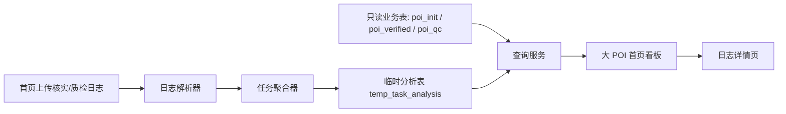

# 大 POI 可视化改造开发计划

## 1. 开发目标

基于现有日志分析项目，完成大 POI 核实 / 质检可视化首页的整体改造，并建立支持大日志场景的“解析后落表，再查询展示”的数据链路。原通用日志分析页保留，作为日志详情追溯页使用。

## 2. 总体方案

## 3. 分阶段计划

### 阶段 1：mock 数据层与临时表基线

目标：

- 建立 mock 数据库
- 导入样例数据
- 建立临时分析表
- 定义导入记录表
- 明确业务表只读边界

产出：

- mock DB 初始化逻辑
- 核实 / 质检基础数据查询逻辑
- 临时分析表设计稿与初始化逻辑
- 数据访问仓储层抽象

建议实现点：

- 业务表镜像：`poi_init / poi_verified / poi_qc`
- 临时分析表：`temp_task_analysis`
- 导入记录表：可选 `analysis_import_history`
- 明确缓存清理只作用于临时分析表和导入记录表

### 阶段 2：日志解析与聚合

目标：

- 解析核实执行日志
- 解析质检执行日志
- 提取任务维度执行指标
- 将结果落入临时分析表
- 设计缺失 `task_id` 时的上下文补关联规则

产出：

- 核实日志解析器
- 质检日志解析器
- Claude 日志 Token / 成本统计器
- 按 `task_id` 聚合的落表逻辑

关键点：

- 从 batch 日志提取任务执行状态、重试次数、开始结束时间
- 从 Claude 日志提取 Session、输入输出 Token、成本、错误信息
- 从任务开始 / 结束提示词识别日志段落边界
- 对缺失 `task_id` 的日志使用前后上下文补关联
- 做好“缺日志 / 缺成果 / 缺质检”的兜底状态

### 阶段 3：查询接口

目标：

- 提供概要查询接口
- 提供详情列表查询接口
- 提供筛选与分页能力
- 提供清缓存接口

产出：

- 概要查询
- 详情查询
- 搜索与状态筛选
- 最近一次导入快照查询
- 清除临时分析缓存

接口建议范围：

- 导入核实日志
- 导入质检日志
- 加载样例日志
- 查询概要
- 查询任务列表
- 查询任务日志追溯信息
- 清除缓存

### 阶段 4：前端页面改造

目标：

- 新增大 POI 首页
- 保持与现有风格一致
- 增加详情展开能力
- 接入日志详情页跳转

产出：

- 4 个概要模块
- 任务列表
- 行内详情展开面板
- 搜索 / 筛选 / 空态 / 异常态
- 日志追溯入口
- 核实 / 质检双上传面板

实现重点：

- 风格延续原项目白底卡片 + 状态标签设计
- 长文本与 JSON 采用折叠交互
- 支持页面级加载态与导入态
- 状态以数据库实际结果为准，不一致时做告警标记
- 人工任务监控模块按 `poi_qc.is_manual_required = 1` 或 `poi_verified.verify_status = "需人工核实"` 进行初版实现

### 阶段 5：联调与收尾

目标：

- 样例数据全链路联调
- 校验指标
- 收敛异常展示

产出：

- 功能联调结果
- 问题修复清单
- 最终文档更新入口

## 4. 实施顺序

1. 先打通 mock DB、只读仓储层和临时表
2. 再实现日志解析与聚合落表
3. 再做概要 / 列表 / 缓存清理查询层
4. 最后接首页展示、日志入口和交互

## 5. 表设计建议

临时分析表 `temp_task_analysis` 建议字段：

- `phase`
- `task_id`
- `row_number`
- `worker_id`
- `batch_id`
- `status`
- `started_at`
- `ended_at`
- `duration_ms`
- `attempt_count`
- `retry_count`
- `session_count`
- `total_input_tokens`
- `total_output_tokens`
- `total_cache_tokens`
- `total_cost_usd`
- `total_tool_calls`
- `total_tool_errors`
- `error_summary`
- `raw_details_json`
- `imported_at`

补充建议：

- 导入记录表保留导入批次和导入时间
- 同一 `task_id + phase` 的展示结果以最新导入记录为准
- 追加导入时保留导入历史，但页面展示按最新聚合结果读取

## 6. 风险控制

### 风险 1：日志与业务数据关联失败

应对：

- 统一按 `task_id` 关联
- 结合开始 / 结束提示词切分段落
- 对缺失 `task_id` 的日志使用上下文补关联
- 保留关联失败状态
- 落表时写入原始详情，便于排查

### 风险 2：大日志导入慢

应对：

- 只在导入时做一次全量解析
- 页面只查库
- 详情长字段默认折叠

### 风险 3：样例库与正式库差异

应对：

- 将数据访问封装为仓储层
- mock DB 只做开发适配，不把库类型写死到业务组件里
- 仓储接口按 PostgreSQL 可替换方式设计

### 风险 4：误操作影响业务数据

应对：

- 明确业务表只读
- 清缓存逻辑仅作用于临时分析表和导入记录表
- 将写操作限定在分析缓存层

## 7. 开发完成定义

满足以下条件视为开发完成：

- 能导入样例日志
- 能落临时分析表
- 能展示 4 个概要模块
- 能按任务列表展示核实 / 质检详情
- 能展示人工任务监控初版结果
- 能清除日志缓存但不影响业务表
- 能处理长文本与异常态
- 样例联调通过
